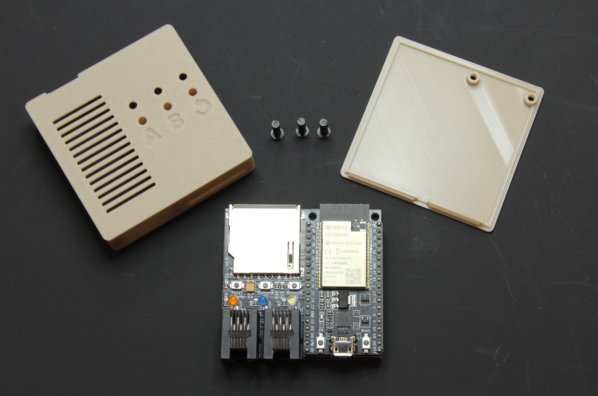

After building a few of mozzwald's original Fujinet for ADAM boards, I decided I wanted to create a new SMD version that was a bit quicker to assemble for folks building them in quantity, but still sticking with the ESP Devkit board and larger 0805 sized components for the DIY crowd. Both boards are single sided for easy assembly, with the only through hole parts being the RJ12 jack(s), LED's, and the devkit board itself. In the end I ended up with two different designs, one I'm calling the Devkit SMD and the Devkit Mini.

# Devkit SMD

Similar to original design, this one offers two ADAMNet ports to daisy chain other devices, but instead of a MicroSD slot, now offers a full size SD card.

You can build it in two different configurations, one using 8.5mm female headers for the devkit board, similar to the original.  This gives the options of reusing the ESP32 for something else in the future and easy access to the SMD components underneath it.  If you are confident in your soldering skills and want something more compact, you can also build it with the ESP board soldered directly to the main PCB on 3mm spaces.

See the [Devkit SMD page](fujinet-adam-devkit-smd/README.md) for BOM and assembly instructions.

# Devkit Mini

This was an exercise in can I make a full Fujinet fit in the space of the devkit PCB. For that I had to go back to a Micro SD slot and it only supports one ADAMNet port.

See the [Devkit Mini page](fujinet-adam-devkit-mini/README.md) for BOM and assembly instructions.

# Getting a Bare Board or Assembled Unit

