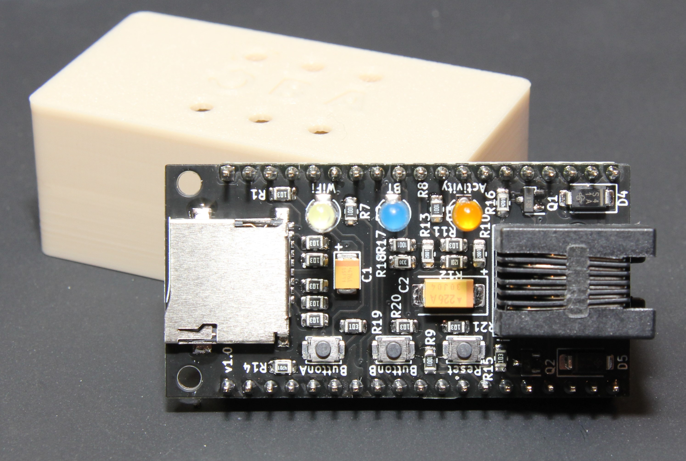
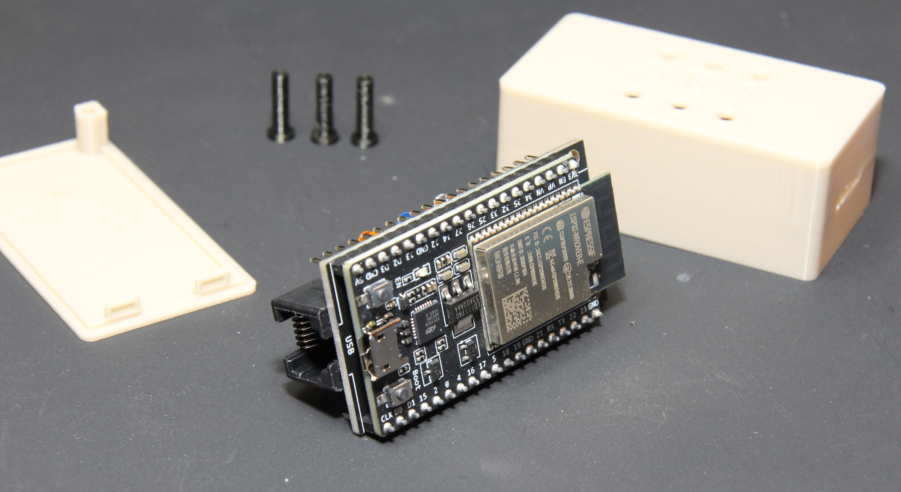
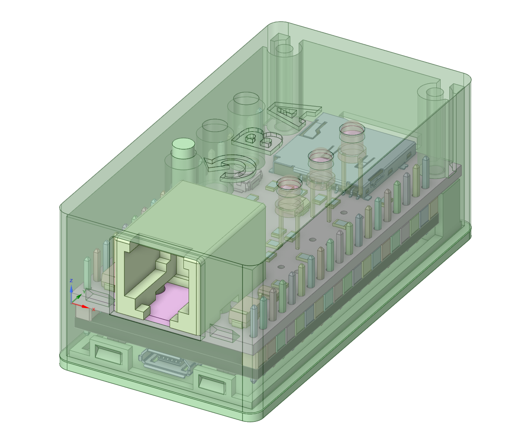

# BOM

There's an interactive BOM [here](https://djtersteegc.github.io/fujinet-adam-hardware/ibom-devkit-mini.html), I find them super useful when placing the SMD parts. 

I buy pretty much everthing from AliExpress suppliers with the exception of the tantalum capacitors (whatever is on clearance at Newark) and the ESP32 board (cheaper shipped from Amazon).

C2 is a bulk storage cap for the 5V input from the ADAMNet line.  I speced it at 100uF, but anything from 22uF and up will probably be fine.  You may not even really need it.

C1 is to handle inrush and prevent sag and MCU reboots on the 3.3V rail if you are hot swapping your SD card.  Mozzwald's original design went without, so not strictly needed, especially if you don't plan on hot swapping the card.

# Assembly

Lay down all the SMD components first. 

Next solder on the RJ12 jack.  For the LED's, I first insert them in the PCB, then the PCB in the case, flip it over and support the case ~1mm off the surface (laying the case across the lip of the lid works well for this) for the LED's to just poke through the top and get a nice reveal. Solder one leg on the LED's, flip it over to check your spacing again, and then solder the other leg.

Finally, solder on the devkit board.  I found the cheap PCB/phone vises work well for holding the main PCB while you do this.

# Case

Make sure to print three buttons.  Assemble with two M2.5x16mm screws.

