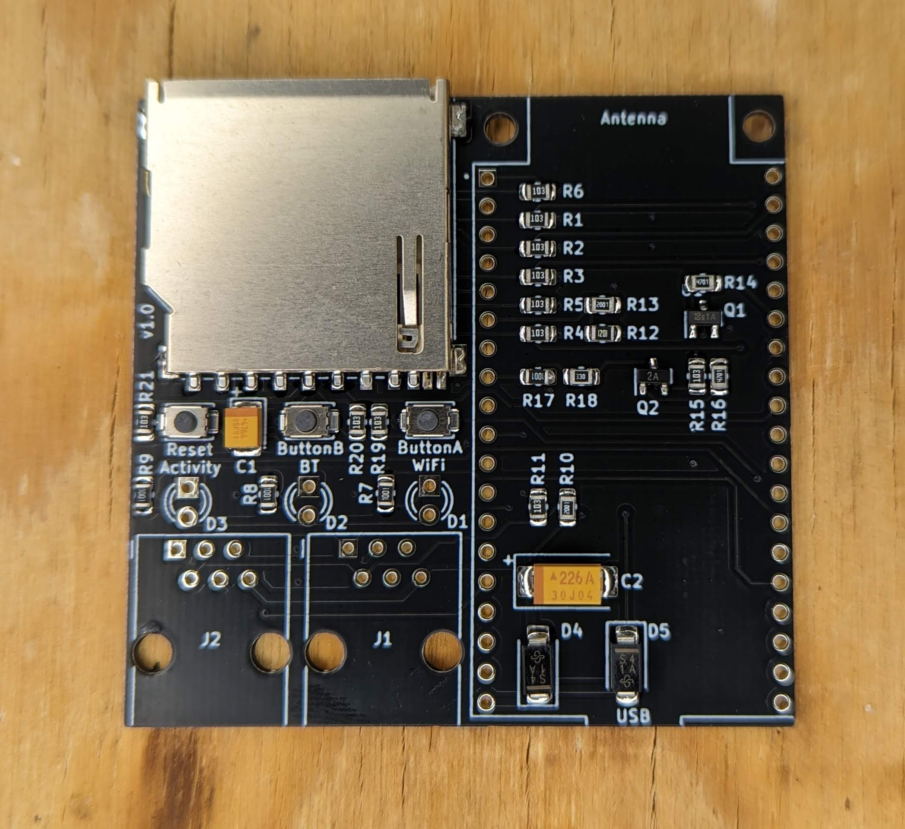
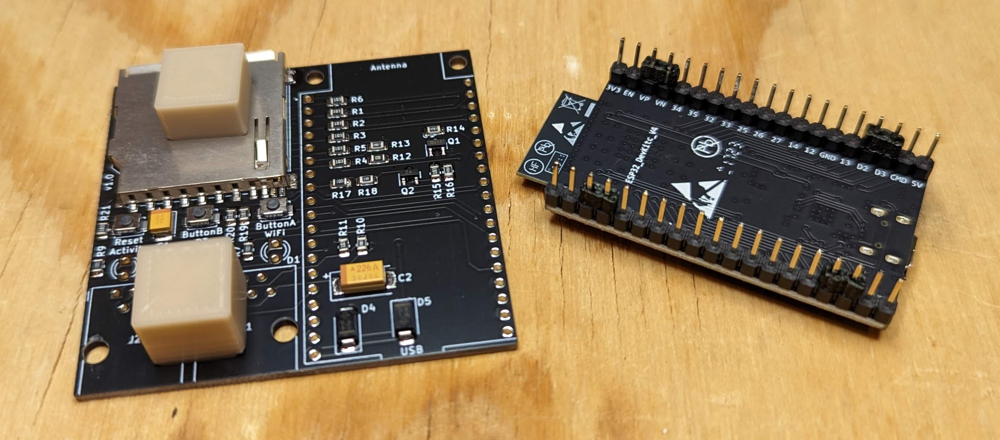
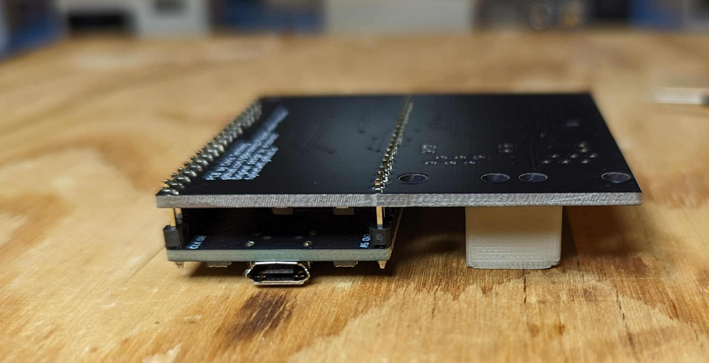
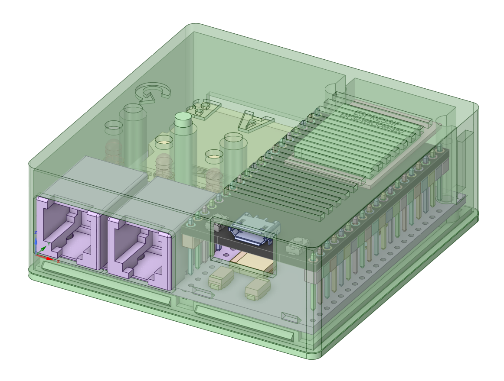
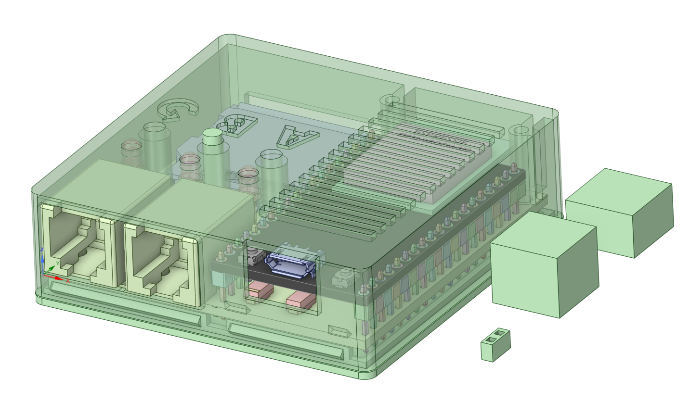

# BOM

There's an interactive BOM [here](https://djtersteegc.github.io/fujinet-adam-hardware/ibom-devkit-smd.html), I find them super useful when placing the SMD parts. 

I buy pretty much everthing from AliExpress suppliers with the exception of the tantalum capacitors (whatever is on clearance at Newark) and the ESP32 board (cheaper shipped from Amazon). If you are bulding in the "tall" configuration, you will also need some 2.54mm female headers.  I buy the 1x40p models and break when down into two 19 pin headers required by the devkit board.

C2 is a bulk storage cap for the 5V input from the ADAMNet line.  I speced it at 100uF, but anything from 22uF and up will probably be fine.  You may not even really need it.

C1 is to handle inrush and prevent sag and MCU reboots on the 3.3V rail if you are hot swapping your SD card.  Mozzwald's original design went without, so not strictly needed, especially if you don't plan on hot swapping the card.

| Component                           | Qty  | Notes                    | Link                                                         |
| ----------------------------------- | ---- | ------------------------ | ------------------------------------------------------------ |
| 47uF 10V 3528 Tantalum Capacitor    | 1    | B Type Case (or smaller) | [AliExpress](https://www.aliexpress.us/item/2251832779546992.html) |
| 100uF 10V 7343 Tantalum Capacitor   | 1    | E Type Case (or smaller) | [AliExpress](https://www.aliexpress.us/item/2251832782845246.html) |
| 10K 0805 Resistor                   | 11   |                          | [AliExpress](https://www.aliexpress.us/item/3256801607747550.html) |
| 1K 0805 Resistor                    | 4    |                          | [AliExpress](https://www.aliexpress.us/item/3256801607747550.html) |
| 2K 0805 Resistor                    | 2    |                          | [AliExpress](https://www.aliexpress.us/item/3256801607747550.html) |
| 4.7K 0805 Resistor                  | 2    |                          | [AliExpress](https://www.aliexpress.us/item/3256801607747550.html) |
| 1.2K 0805 Resistor                  | 1    |                          | [AliExpress](https://www.aliexpress.us/item/3256801607747550.html) |
| 33R 0805 Resistor                   | 1    |                          | [AliExpress](https://www.aliexpress.us/item/3256801607747550.html) |
| B140 SMA DO-214 Schottky Diode      | 2    | SS14 also works          | [AliExpress](https://www.aliexpress.us/item/2255800145156429.html) |
| 3mm LED (Blue)                      | 1    | Bluetooth                | [AliExpress](https://www.aliexpress.us/item/2255800226600744.html) |
| 3mm LED (White)                     | 1    | Wifi                     | [AliExpress](https://www.aliexpress.us/item/2255800226600744.html) |
| 3mm LED (Orange)                    | 1    | Activity                 | [AliExpress](https://www.aliexpress.us/item/2255800226600744.html) |
| Alps SKRK Style Switch              | 3    | 3x4x2mm                  | [AliExpress](https://www.aliexpress.us/item/2255801131587911.html) |
| MMBT3904 SOT-23                     | 1    |                          | [AliExpress](https://www.aliexpress.us/item/3256802985590487.html) |
| MMBT3906 SOT-23                     | 1    |                          | [AliExpress](https://www.aliexpress.us/item/3256802985563795.html) |
| RJ12 Amphenol 54601                 | 2    | 95001-6P6C on Ali        | [AliExpress](https://www.aliexpress.us/item/3256802891796239.html) |
| SD Card TE 2041021                  | 1    | Long Body on Ali         | [AliExpress](https://www.aliexpress.us/item/3256805779248826.html) |
| ESP32-Devkit-C-VE                   | 1    |                          | [Amazon](https://www.amazon.com/dp/B087TNPQCV)               |
| 2.54mm 19p 8.5mm Tall Female Header | 2    | "Tall" option build only | [AliExpress](https://www.aliexpress.us/item/2251832484668248.html) |

# Flashing

I like to program the ESP32 first to ensure I have a good unit before soldering them onto the main PCB. Since this uses the same devkit board as the "official" model, you can use the FujiNet firmware flasher available at https://fujinet.online/download/. 

# Assembly

Lay down all the SMD components first.  When complete, your board shoud look like this.

Next decide if you are building it on female headers or soldering the devkit directly to the board.  If the latter, there are some 3mm spacers and support blocks in the "short" 3D directory you can print out to space the devkit board correctly and keep the board level when you flip it over to solder it together.

Next solder on the two RJ12 jacks.  For the LED's, I first insert them in the PCB, then the PCB in the case, flip it over and support the case ~1mm off the surface for the LED's to just poke through the top and get a nice reveal. Solder one leg on the LED's, flip it over to check your spacing again, and then solder the other leg.

# Case

If built on female headers, print the files in the "tall" directory.  Make sure to print three buttons.  If soldering directly to the board spaced 3mm above it, use the case file in the "short" directory.  Assemble with two M2.5x10mm screws.

